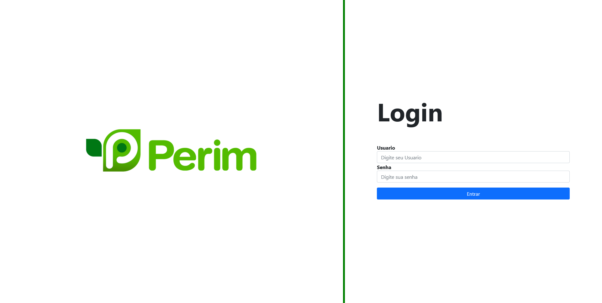

<h1 align="center">Teste de Django Perim</h1>



<br>

# Descrição do Projeto

<p align="center">🚀 Repositorio da resolução do projeto proposto para avaliação de candidatura para cargo de estagio em desenvolvimento com Django, proposto pelo Perim

Ao construir a aplicação, foi proposto as seguintes funcionalidades:

- [x] **Cadastro de cliente** - O sistema deve permitir que o usuário cadastre informações do cliente, como nome, CPF, endereços de entrega e telefone.
- [x] **Cadastro de entrega** - O sistema deve permitir que o usuário cadastre uma nova entrega, com informações como nome do cliente, endereço, número de caixas, volumes extras como Bebidas, Frios/Congelados, Vassouras/Rodo, Outros, Nome do embalador, número e serie da NFCe, Data da Compra, Data e hora da Entrega.
- [x] **Listagem de entregas/clientes** -  O sistema deve permitir a listagem de todas as entregas já realizadas e clientes, com opções para editar e excluir cada uma delas.

# ✅ Pré-requisitos

Antes de começar, você vai precisar ter instalado em sua máquina as seguintes ferramentas:
[Git](https://git-scm.com), [Python](https://www.python.org/).

# 🎲 Rodando a Aplicação

```bash
# Clone este repositório
$ git clone <https://github.com/thiagobcoelho25/teste-django-perim>

# Instalar todas as bibliotecas utilizadas
$ pip install -r requirements.txt

# Acesse a pasta do projeto no terminal/cmd
$ cd perimapi

# Execute a aplicação com o seguinte comando
$ python manage.py runserver

# O servidor inciará na porta:8000 - acesse <http://localhost:8000>
# Ja existira um usuario cadastrado com o nome de 'admin' e senha 'admin'
```
<br>
<br>

# Tecnologias

As seguintes ferramentas foram usadas na construção do projeto:

- [Python.js](https://www.python.org/)
- [Django](https://www.djangoproject.com/)
- [CSS](https://sass-lang.com/)
- [BootStrap](https://getbootstrap.com/)

<br>
<br>

# Autor

<br>

<a href="https://github.com/thiagobcoelho25">
 
 <br />
 <sub><b>Thiago Ribeiro</b></sub></a> <a href="https://github.com/thiagobcoelho25" title="Rocketseat">🚀</a>

Feito com ❤️ por Thiago Ribeiro 👋🏽 Entre em contato!

[](https://www.linkedin.com/in/thiagobcoelho25/)
[](mailto:thiagobcoelho25@gmail.com)
